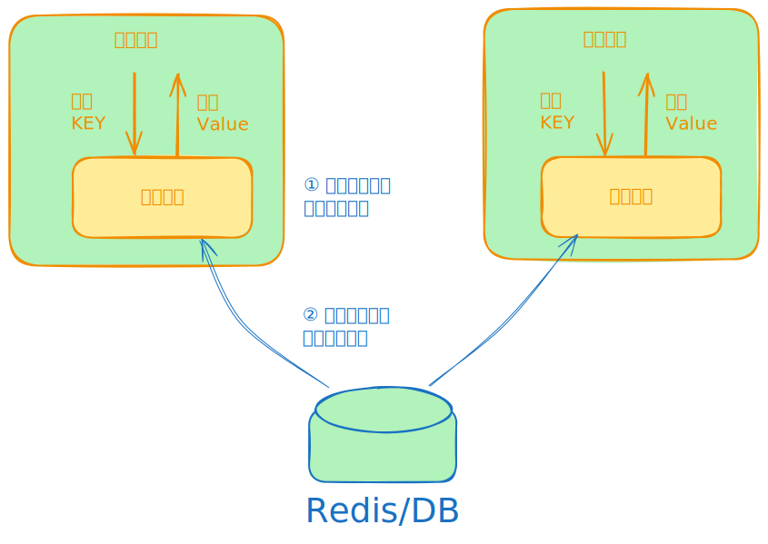

# Loading Cache

At its core, loading cache is a rather simple cache implementation.
It is heavily inspired by [Guava](https://github.com/google/guava/wiki/CachesExplained).

[](https://excalidraw.com/#json=wZ4HQF2bo3P4eGzxpOzd_,VkZ5fR28wpaOTbKCbZzHMQ)

## Features

1. 2024年03月25日: 增加从 [Redis/DB 中异步加载缓存值](./loader/dbloader/dbloader_test.go#L16)的示例
2. 2024年03月25日: 支持 key 过期时，异步加载，异步加载未完成时，访问对应的 Key 返回过期值.

## Basics

You can use it as a simple, no fuss cache.

```go
package main

import (
	"fmt"
	"time"

	"github.com/goldstd/loadingcache"
)

type sharedLoader struct{}

func (b *sharedLoader) Load(a any) (any, error) {
	// 从 redis / mysql 中加载数据
	return "abc", nil
}

func main() {
	cache := loadingcache.Config{
		Load:             &sharedLoader{},
		ExpireAfterWrite: 10 * time.Minute,
		AsyncLoad:        true, // 支持 key 过期时，异步加载
	}.Build()

	// Adding some values and reading them
	cache.Put("a", 1)
	cache.Put("b", 2)
	cache.Put("c", 3)
	val1, _ := cache.Get("a") // Don't forget to check for errors
	fmt.Printf("%v\n", val1)
	val2, _ := cache.Get("b") // Don't forget to check for errors
	fmt.Printf("%v\n", val2)

	// Getting a value that does not exist
	_, err := cache.Get("d")
	if errors.Is(err, loadingcache.ErrKeyNotFound) {
		fmt.Println("That key does not exist")
	}

	// Evicting
	cache.Invalidate("a")
	cache.Invalidate("b", "c")
	cache.InvalidateAll()

	// Output: 1
	// 2
	// That key does not exist
}

```

# Advanced

You can also use more advanced options.

```go
package main

import (
	"github.com/goldstd/loadingcache"
)

func main() {
	cache := loadingcache.Config{
		MaxSize:          2,
		ExpireAfterRead:  2 * time.Minute,
		ExpireAfterWrite: time.Minute,
		EvictListeners: []loadingcache.EvictListener{
			func(notification loadingcache.EvictNotification) {
				fmt.Printf("Entry removed due to %s\n", notification.Reason)
			},
		},
		ShardHashFunc: func(key any) (any, error) {
			fmt.Printf("Loading key %v\n", key)
			return fmt.Sprint(key), nil
		},
	}.Build()

	cache.Put(1, "1")
	val1, _ := cache.Get(1)
	fmt.Printf("%v\n", val1)

	val2, _ := cache.Get(2)
	fmt.Printf("%v\n", val2)

	val3, _ := cache.Get(3)
	fmt.Printf("%v\n", val3)

	// Output: 1
	// Loading key 2
	// 2
	// Loading key 3
	// Entry removed due to SIZE
	// 3
}
```

## Benchmarks

Although preliminary, below you can find some benchmarks (included in the repo).

```
$ go test -benchmem -bench .
goos: darwin
goarch: amd64
pkg: github.com/goldstd/loadingcache
cpu: Intel(R) Core(TM) i7-8850H CPU @ 2.60GHz
BenchmarkGetMiss/Sharded_(2)-12           400610              2631 ns/op            1016 B/op         12 allocs/op
BenchmarkGetMiss/Sharded_(3)-12           451284              2618 ns/op            1016 B/op         12 allocs/op
BenchmarkGetMiss/Sharded_(16)-12                  447225              2709 ns/op            1016 B/op         12 allocs/op
BenchmarkGetMiss/Sharded_(32)-12                  441804              2649 ns/op            1015 B/op         12 allocs/op
BenchmarkGetMiss/Simple-12                        737130              1582 ns/op             680 B/op          8 allocs/op
BenchmarkGetHit/Simple-12                        9312319               126.5 ns/op             0 B/op          0 allocs/op
BenchmarkGetHit/Sharded_(2)-12                   8891150               137.2 ns/op             0 B/op          0 allocs/op
BenchmarkGetHit/Sharded_(3)-12                   8845831               137.3 ns/op             0 B/op          0 allocs/op
BenchmarkGetHit/Sharded_(16)-12                  8769058               136.0 ns/op             0 B/op          0 allocs/op
BenchmarkGetHit/Sharded_(32)-12                  8685018               136.1 ns/op             0 B/op          0 allocs/op
BenchmarkPutNew/Sharded_(2)-12                     12978            175136 ns/op              75 B/op          1 allocs/op
BenchmarkPutNew/Sharded_(3)-12                     20353            156025 ns/op             143 B/op          2 allocs/op
BenchmarkPutNew/Sharded_(16)-12                    93429            129674 ns/op             146 B/op          2 allocs/op
BenchmarkPutNew/Sharded_(32)-12                   145015            105135 ns/op             172 B/op          2 allocs/op
BenchmarkPutNew/Simple-12                          10000            181544 ns/op             168 B/op          2 allocs/op
BenchmarkPutNewNoPreWrite/Simple-12              1920939               627.5 ns/op           136 B/op          2 allocs/op
BenchmarkPutNewNoPreWrite/Sharded_(2)-12         2016948               725.2 ns/op           133 B/op          2 allocs/op
BenchmarkPutNewNoPreWrite/Sharded_(3)-12         2041030               594.4 ns/op           118 B/op          2 allocs/op
BenchmarkPutNewNoPreWrite/Sharded_(16)-12                2113516               627.2 ns/op           130 B/op          2 allocs/op
BenchmarkPutNewNoPreWrite/Sharded_(32)-12                1934784               684.8 ns/op           136 B/op          2 allocs/op
BenchmarkPutReplace-12                                   3397014               341.8 ns/op            64 B/op          1 allocs/op
BenchmarkPutAtMaxSize-12                                 3076584               380.7 ns/op            71 B/op          1 allocs/op
PASS
ok      github.com/goldstd/loadingcache 74.447s

```


## gocache

☔️ [gocache](https://github.com/eko/gocache) A complete Go cache library that brings you multiple ways of managing your caches
☔️ 一个完整的 Go 缓存库，为您提供多种管理缓存的方式 
Starting from this interface, the implemented cache types are the following:

- Cache: The basic cache that allows to manipulate data from the given stores,
- Chain: A special cache adapter that allows to chain multiple cache (could be because you have a memory cache, a redis cache, etc...),
- Loadable: A special cache adapter that allows to specify a kind of callback function to automatically reload data into your cache if expired or invalidated,
- Metric: A special cache adapter that allows to store metrics about your cache data: how many items setted, getted, invalidated, successfully or not.

A loadable cache 可加载的缓存

This cache will provide a load function that acts as a callable function and will set your data back in your cache in case they are not available:
此缓存将提供一个加载函数，该函数充当可调用函数，并在数据不可用时将数据放回缓存中：

```go
type Book struct {
    ID string
    Name string
}

// Initialize Redis client and store
redisClient := redis.NewClient(&redis.Options{Addr: "127.0.0.1:6379"})
redisStore := redis_store.NewRedis(redisClient)

// Initialize a load function that loads your data from a custom source
loadFunction := func(ctx context.Context, key any) (*Book, error) {
    // ... retrieve value from available source
    return &Book{ID: 1, Name: "My test amazing book"}, nil
}

// Initialize loadable cache
cacheManager := cache.NewLoadable[*Book](
    loadFunction,
    cache.New[*Book](redisStore),
)

// ... Then, you can get your data and your function will automatically put them in cache(s)
```

Of course, you can also pass a Chain cache into the Loadable one so if your data is not available in all caches, it will bring it back in all caches.
